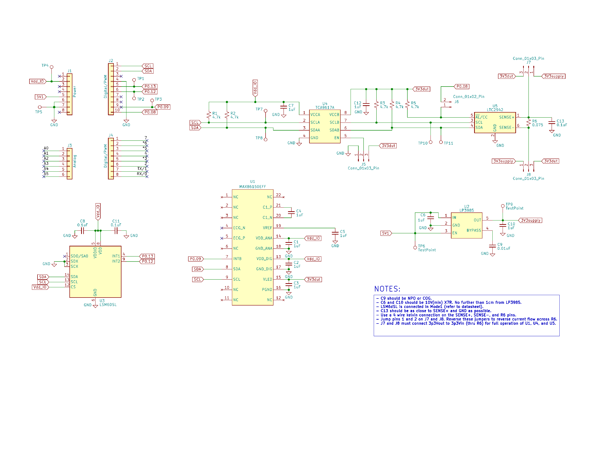
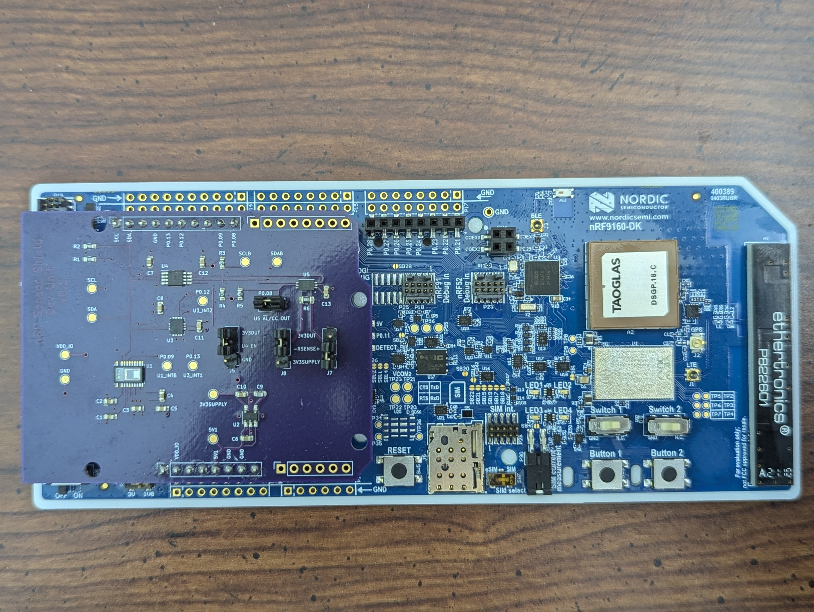

# nrfDK_Sensor_Dev_Shield
Sensor shield compatible with nRFDK and Arduino development boards

## Details
- Test platform for sensors intended for use on an IoT wearable
- Interfaces directly with an nRF9160DK development board over I2C
- Contains a heart rate monitor, 9-DOF IMU, and coulomb counter with reversible current
- Test points for all signals and voltages

